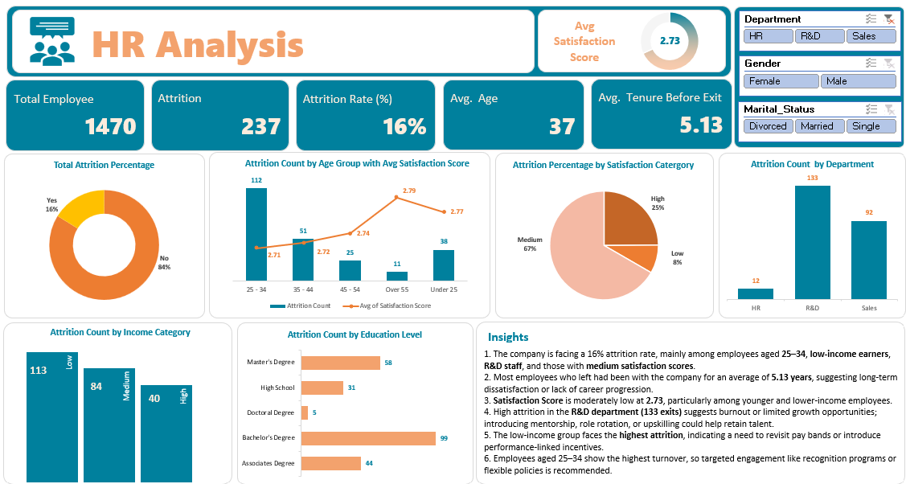

# HR Data Analysis Dashboard by Excel
An Excel-based interactive dashboard for analyzing employee attrition using **Power Query**, **pivot tables**, and **visual storytelling**. The dashboard highlights key HR metrics such as attrition rate, tenure, satisfaction, department-wise breakdowns, and more.

---

## Dashboard Preview

---

## Project Content

| File | Description |
|------|-------------|
| `HR DATA_Excel.xlsx` | Raw employee dataset |
| `HR_Data_Analysis_Dashboard.xlsx` | Cleaned data + interactive dashboard |

---

## Key Highlights

- **Total Employees Analyzed:** 1,470  
- **Total Attrition:** 237 employees  
- **Attrition Rate:** 16%  
- **Average Age:** 37 years  
- **Average Tenure Before Exit:** 5.13 years  
- **Average Satisfaction Score:** 2.73  

---

## Insights & Storytelling

1. The company is facing a **16% attrition rate**, mainly among employees aged **25–34**, **low-income earners**, **R&D staff**, and those with **medium satisfaction scores**.
2. Most employees who left had an **average tenure of 5.13 years**, indicating long-term dissatisfaction or limited career growth.
3. The **satisfaction score is moderately low** at **2.73**, especially for younger and lower-income employees.
4. **R&D department** has the highest attrition count (**133 exits**), hinting at burnout or lack of advancement opportunities.
5. Employees in the **low-income category** show the highest attrition (113), suggesting a need for better compensation or performance-linked benefits.
6. Employees aged **25–34** account for the highest exits (112), which may be improved with **targeted retention strategies** like mentorship, recognition, or flexible work options.

---

## Tools & Techniques Used

- **Excel Power Query** for data transformation  
- **Pivot Tables & Charts** for summarizing metrics  
- **Slicers** for interactivity by Department, Gender, Marital Status  
- **Visuals:** Donut chart, bar charts, column charts, combo charts  

---

## How to Use the Dashboard

1. Open `HR_Data_Analysis_Dashboard.xlsx` in Excel.
2. Use slicers on the top-right to filter by department, gender, and marital status.
3. Explore charts showing trends by age, education level, income, and satisfaction.
4. Refresh the Power Query if the source dataset (`HR DATA_Excel.xlsx`) changes.

---

### Built by SadiaHossain21

